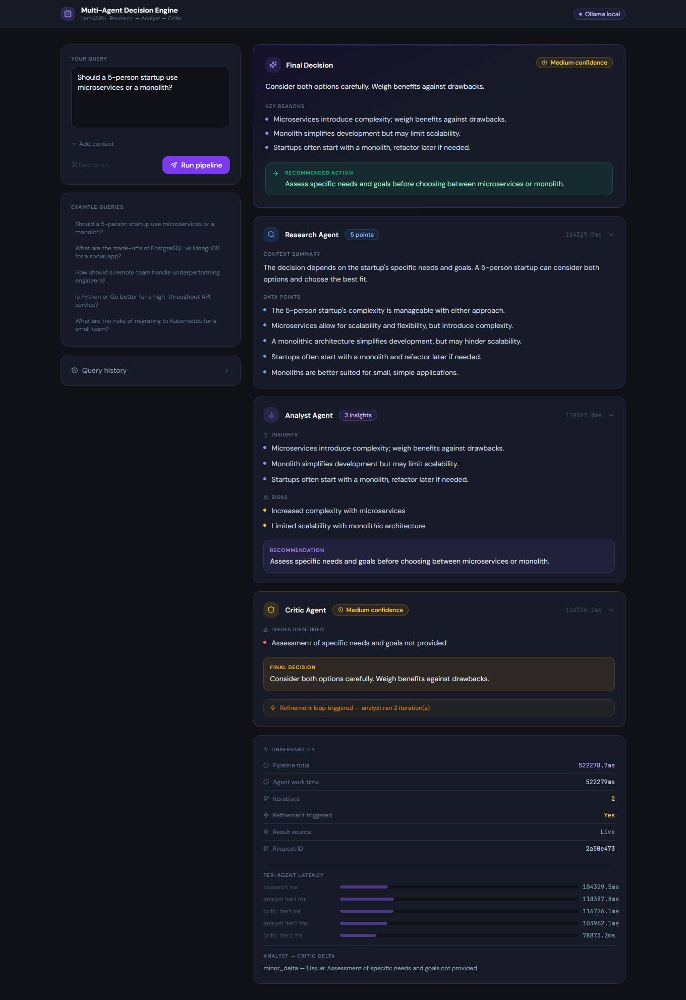
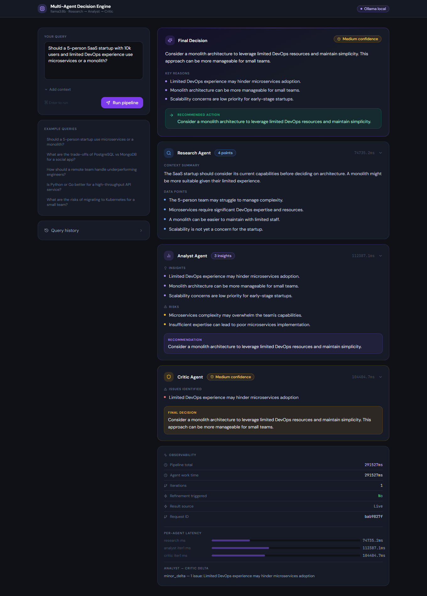

# 🚀 Multi-Agent AI System — Autonomous Decision Engine

A **fully local, production-ready multi-agent AI system** that performs structured decision-making using LLM-powered agents.

Built using **Ollama + FastAPI + React**, this system enables **collaborative reasoning across multiple agents** — Research, Analysis, and Critique — to generate reliable, explainable decisions.

---

## 🧠 How it works

```
User Query
   ↓
Orchestrator
   ↓
Research Agent   → gathers data + context
   ↓
Analyst Agent    → generates insights + risks
   ↓
Critic Agent     → validates + refines output
   ↓
Final Decision (with confidence score)
```

If the critic detects issues, the system **automatically refines the response**.

---

## 🔍 Key Features

* 🤖 Multi-agent reasoning pipeline (Research → Analysis → Critique)
* 🧠 Context-aware decision generation
* 🔁 Automatic refinement loop for better accuracy
* 📊 Confidence scoring & explainability
* 💾 Memory system (decision history)
* ⚡ Query caching for performance optimization
* 📈 Observability panel with pipeline timings
* 🔒 Fully local (no external APIs, privacy-first)

---

## 🛠️ Tech Stack

* **Backend:** FastAPI, Python
* **Frontend:** React, Vite, Tailwind CSS
* **LLM Runtime:** Ollama (llama3:8b)
* **Data Handling:** JSON memory + caching
* **Validation:** Pydantic

---

## 📸 Demo Screenshots

### 🧠 Multi-Agent Decision Flow



### 🏗️ Architecture Decision Example



### 📊 Business Strategy Analysis


### 🏦 AI Adoption Decision


### 🔁 Critic-Based Refinement Loop


---

## ⚙️ Setup & Run

### 1. Start Ollama

```bash id="run1"
ollama serve
ollama pull llama3:8b
```

---

### 2. Backend

```bash id="run2"
cd backend
python -m venv venv
venv\Scripts\activate   # Windows
pip install -r requirements.txt

mkdir logs data
uvicorn main:app --reload --host 0.0.0.0 --port 8000
```

Backend: http://localhost:8000
Docs: http://localhost:8000/docs

---

### 3. Frontend

```bash id="run3"
cd frontend
npm install
npm run dev
```

App: http://localhost:3000

---

## 📡 API Example

### POST /api/query

```json id="api1"
{
  "query": "Should our startup use microservices or monolith?",
  "context": "Small team, growing user base"
}
```

---

## 📊 Observability

* Logs stored in: `backend/logs/agents.log`
* Includes:

  * request_id tracking
  * latency breakdown
  * pipeline stages

---

## ⚡ Performance

| Model      | Avg Time |
| ---------- | -------- |
| llama3:8b  | 25–40s   |
| llama3:70b | 90–150s  |

---

## 🧠 Key Insight

This project demonstrates that **AI system performance depends not just on models, but on how retrieval, reasoning, and orchestration are combined effectively.**

---

## 🚀 Future Improvements

* Vector database integration (FAISS / Chroma)
* Streaming responses
* Better document parsing
* Cloud deployment (Docker)

---

## 👨‍💻 Author

**Kanishk Joshi**
